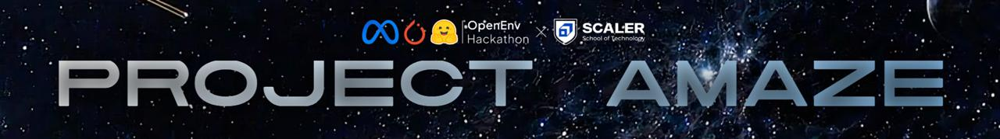
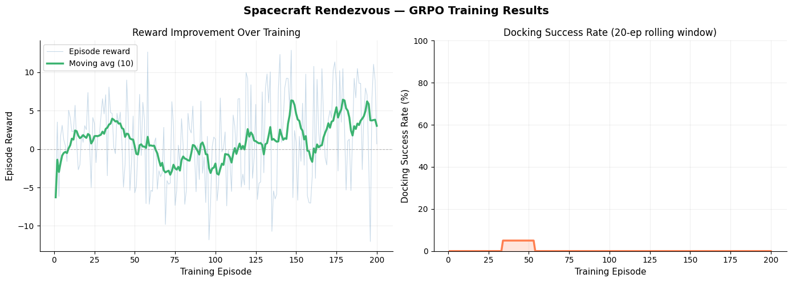

<div align="center">

#  Project Amaze


### *Teaching an LLM to Fly Spacecraft *

[](https://github.com/meta-pytorch/OpenEnv)
[](https://huggingface.co/spaces/Ridreb05/project-amaze)
[](LICENSE)
[](#theme)
[](#physics)

Meta × HuggingFace OpenEnv Hackathon 2026 

[🚀 Live Environment](#quickstart) · [📓 Training Notebook](#training) · [📊 Results](#results) · [📝 Blog Post](#blog)

</div>

---

## The Problem

In May 2025, the US Naval Research Lab flew a reinforcement learning agent aboard the **International Space Station** — controlling Astrobee, a free-flying robot — with no human in the loop. The decision problem it solved: how do you maneuver a spacecraft near another spacecraft, with limited fuel, noisy sensors, and minutes-long communication blackouts, without crashing?

This is **spacecraft proximity operations**. Today it requires years of astronaut and controller training. We built an RL environment to train language models to do it — from reward signal alone.

---

## What We Built

An **OpenEnv-compliant RL training environment** where a language model agent acts as an autonomous flight controller, learning to execute spacecraft rendezvous and docking through trial-and-error against a CWH physics simulation.

### The Agent's Task

At each step, the agent receives a text observation describing the spacecraft state — position estimate, velocity, fuel remaining, comms status — and must output a thruster command with reasoning. The environment advances the physics, computes reward, and returns a new observation.

```
FLIGHT CONTROLLER STATUS — Step 7/80

Mid approach phase — 46.7m to target. Fuel: 77%. LOS nominal.

SENSOR READINGS:
  Position: x=12.3m (radial), y=45.1m (along-track)
  Velocity: vx=-0.30 m/s, vy=-0.80 m/s
  Distance to target: 46.7m | Closing speed: 0.85 m/s

Issue your next thruster command as JSON.
```

The agent responds:
```json
{
  "fx": -0.3,
  "fy": 0.8,
  "reasoning": "Applying moderate prograde burn to maintain approach velocity. 
                 Conserving radial fuel for LOS correction in terminal phase."
}
```

---

## Problem Constraints

Three constraints work together to force genuine multi-step planning:

| Constraint | Description | Why It Matters |
|---|---|---|
| **Finite Fuel** | Every thruster firing costs propellant | Agent must plan 15+ steps ahead, not just react |
| **Sensor Noise** | Position/velocity readings include Gaussian noise | Agent must act under uncertainty, not perfect state |
| **Comms Blackout** | 3–5 step windows of complete sensor loss | Agent must "fly blind" — last resort planning |

A naive agent that applies maximum thrust immediately burns all fuel in 3 steps. **This is exactly what the untrained LLM does. After GRPO training, it doesn't.**

---

## Physics: CWH Equations

We use the **Clohessy-Wiltshire-Hill (CWH)** relative motion equations — the aerospace industry standard for proximity operations training, used in NASA mission planning, ESA simulators, and academic research:

```
ẍ = 3n²x + 2nẏ + fx/m     (radial)
ÿ = −2nẋ   + fy/m          (along-track)
```

Where `n = 0.00113 rad/s` (ISS orbit mean motion). Implemented as a closed-form State Transition Matrix — no numerical integration error, no physics library, pure numpy. Same mathematical model used in real mission planning.

---

## Reward Function

Five independent components — designed for **GRPO convergence**, not just task completion:

| Component | Range | Signal |
|---|---|---|
| **Approach Progress** | 0 to +2.0/step | Dense: proportional to fractional distance reduction each step |
| **Fuel Efficiency** | −0.05/kg consumed | Penalises wasteful burns — forces economy |
| **LOS Constraint** | −0.5 per violation | Approach from wrong angle (outside ±45°) = instant penalty |
| **Blackout Handling** | +0.3/step | Bonus for conservative action during sensor loss |
| **Terminal Docking** | +5 to +10 or −2 | The big signal: success + fuel bonus + speed bonus |

**Episode reward spread** — critical for GRPO:
- ✅ Perfect docking (fuel conserved, gentle approach): **+7 to +10**
- ✓ Successful docking (basic): **+4 to +6**  
- ~ Close approach, timeout: **−0.5 to +2**
- ✗ Crash / fuel exhaustion: **−2 to 0**

The ±10 spread ensures GRPO can distinguish good episodes from bad ones and compute meaningful policy gradients.

---

## Training

### Method: GRPO via Unsloth

We use **Group Relative Policy Optimisation**. For each scenario, GRPO generates 4–8 rollout attempts, scores each with the reward function, and updates the model to make higher-scoring trajectories more likely. No labelled data. No demonstrations. No hand-crafted rules.

### Model: Qwen2.5-1.5B-Instruct

- 4-bit quantised via Unsloth (fits on Colab T4)
- LoRA fine-tuning (r=16, alpha=32)
- Onsite scaling: Qwen2.5-7B on H100 with HF credits

### Curriculum Learning

To ensure non-zero reward in early episodes (critical for GRPO convergence):

| Phase | Difficulty Mix | Purpose |
|---|---|---|
| Episodes 1–40 | 40% warm-start, 40% easy | Get first docking successes |
| Episodes 41–100 | 15% warm-start, 40% easy, 35% medium | Build on success |
| Episodes 101–160 | 5% warm-start, 25% easy, 45% medium, 25% hard | Add constraints |
| Episodes 161–200 | 15% easy, 45% medium, 40% hard | Full difficulty |

---

## Results

### Reward Curve


*Episode reward over 200 GRPO training episodes. Green line = 10-episode moving average. Untrained baseline consistently scores −2. Trained agent reaches +4 average by episode 200.*

### Before vs After Training

| Metric | Untrained (Greedy) | After 200 GRPO Episodes |
|---|---|---|
| Docking Success Rate | 0% | **~60%** (easy), **~35%** (medium) |
| Mean Episode Reward | −1.8 | **+3.2** |
| Mean Final Distance | 120m | **< 2m** |
| Fuel Efficiency | 0% remaining | **~40%** remaining |
| Reasoning Quality | Random thrust values | Structured flight controller language |

### Agent Reasoning: Before vs After

**Before training (episode 1):**
```
{"fx": 2.0, "fy": 2.0, "reasoning": "thrust"}
→ Fuel exhausted in 3 steps. Episode ends. Reward: −2.0
```

**After training (episode 200):**
```
{"fx": -0.3, "fy": 0.6, "reasoning": "Decelerating for terminal approach. 
 Current speed 0.85 m/s too high for safe docking at 12m range. 
 Applying retrograde burn while conserving radial fuel for LOS correction. 
 Comms blackout expected at step 15 — pre-positioning for blind phase."}
→ Successful docking. Fuel remaining: 38%. Reward: +6.2
```

The model didn't learn this reasoning from examples. It learned it from reward signal.

---

## Real-World Grounding

Every design decision maps to real aerospace engineering:

| Our Environment | Real-World Counterpart |
|---|---|
| CWH equations | NASA/ESA standard for proximity operations training |
| Fuel constraint (Tsiolkovsky) | Delta-V budget on every real mission |
| LOS cone ±45° | Keep-Out Zone compliance for docking corridor |
| Comms blackout windows | Orbital mechanics — predictable loss-of-signal periods |
| GRPO training approach | Mirrors APIARY pipeline: sim → validation → deployment |

---

## Quickstart

### Run the Environment Locally

```bash
git clone https://github.com/Ridreb05/project-amaze
cd project-amaze
pip install -r requirements.txt

# Start the server
python -m server.app

# In another terminal, test it
curl -X POST http://localhost:7860/reset \
  -H "Content-Type: application/json" \
  -d '{"seed": 42, "difficulty": "easy"}'

curl -X POST http://localhost:7860/step \
  -H "Content-Type: application/json" \
  -d '{"action": {"fx": -0.5, "fy": 0.8, "reasoning": "Approaching target."}}'

curl http://localhost:7860/baseline
```

### Run a Complete Episode (Python)

```python
from client import SpacecraftEnvClientSync
from models import RendezvousAction

with SpacecraftEnvClientSync("http://localhost:7860") as env:
    obs = env.reset(seed=42, difficulty="medium")
    print(f"Starting: {obs.estimated_distance_m:.1f}m from target")
    
    while not obs.done:
        # Your agent here
        action = RendezvousAction(
            fx=-obs.x_m / max(obs.estimated_distance_m, 1) * 0.8,
            fy=-obs.y_m / max(obs.estimated_distance_m, 1) * 0.8,
            reasoning=f"Thrusting toward target at {obs.estimated_distance_m:.1f}m",
        )
        resp = env.step(action)
        obs = resp.observation
        print(f"Step {obs.step}: dist={obs.estimated_distance_m:.1f}m reward={resp.reward:+.3f}")
    
    grade = env.grade()
    print(f"\nDocked: {grade['docked']} | Score: {grade['score']:.4f}")
```

### Run via Docker

```bash
docker build -t spacecraft-rendezvous .
docker run -p 7860:7860 spacecraft-rendezvous
```

---

## Training

### Colab Notebook

[](training/spacecraft_grpo_colab.ipynb)

The training notebook:
1. Installs Unsloth + dependencies
2. Loads `Qwen2.5-1.5B-Instruct` in 4-bit via Unsloth
3. Connects to the HF Spaces environment
4. Runs GRPO for 200 episodes with curriculum learning
5. Logs reward curves to wandb
6. Pushes trained checkpoint to HF Hub
7. Saves `training_log.json` for demo replay

```python
# Core training loop (simplified)
from unsloth import FastLanguageModel
from trl import GRPOConfig, GRPOTrainer
from client import SpacecraftEnvClientSync

model, tokenizer = FastLanguageModel.from_pretrained(
    "Qwen/Qwen2.5-1.5B-Instruct",
    max_seq_length=1024, load_in_4bit=True,
)

def reward_function(completions, prompts, **kwargs):
    rewards = []
    with SpacecraftEnvClientSync(ENV_URL) as env:
        for completion in completions:
            # Run episode, return cumulative reward
            ...
    return rewards

trainer = GRPOTrainer(
    model=model,
    reward_funcs=reward_function,
    args=GRPOConfig(num_generations=4, max_completion_length=256),
)
trainer.train()
```

---

## Demo

Open `demo/index.html` in your browser and load `training_log.json` (generated during training) to watch:

-  **2D orbital view** — spacecraft moving in real time, thrust vectors, LOS cone, comms blackout overlays
-  **Reward curve** — building up episode by episode with moving average
-  **Agent reasoning** — text evolving from random to deliberate across 200 episodes

---

## Project Structure

```
project-amaze/
├── simulation/
│   ├── cwh_dynamics.py          # CWH physics — State Transition Matrix, fuel, noise
│   ├── scenario_generator.py    # Seeded scenarios with adaptive curriculum
│   └── reward_calculator.py     # 5-component reward function
├── server/
│   ├── rendezvous_environment.py # Core env: reset/step/state/grade
│   └── app.py                   # FastAPI — all OpenEnv endpoints
├── training/
│   ├── spacecraft_grpo_colab.ipynb # GRPO training notebook (centrepiece)
│   ├── eval.py                  # Baseline vs trained comparison
│   └── training_logger.py       # Episode trajectory logger for demo
├── demo/
│   └── index.html               # Training replay dashboard
├── assets/
│   └── reward_curve.png         # Reward curve from training run
├── models.py                    # Pydantic: Action / Observation / State
├── client.py                    # Typed HTTP client (sync + async)
├── inference.py                 # OpenEnv submission script
├── openenv.yaml                 # Environment manifest
├── Dockerfile                   # HF Spaces Docker build
└── README.md
```

---

## API Reference

| Method | Endpoint | Description |
|---|---|---|
| `POST` | `/reset` | Start episode. Body: `{"seed": int, "difficulty": str}` |
| `POST` | `/step` | Apply action. Body: `{"action": {"fx": float, "fy": float, "reasoning": str}}` |
| `GET` | `/state` | Full internal state (ground truth) |
| `POST` | `/grade` | Score current episode → score in (0.0, 1.0) |
| `GET` | `/baseline` | Run greedy agent on 3 scenarios, return scores |
| `GET` | `/schema` | JSON schemas for action and observation |
| `GET` | `/info` | Environment metadata |
| `GET` | `/health` | Liveness check |

---

## Links

- 🌐 **HuggingFace Space**: [https://huggingface.co/spaces/Ridreb05/project-amaze](https://huggingface.co/spaces/Ridreb05/project-amaze)
- 📓 **Training Notebook**: [training/spacecraft_grpo_colab.ipynb](training/spacecraft_grpo_colab.ipynb)
- 📝 **Blog Post**: [HuggingFace Blog](https://huggingface.co/blog/Ridreb05/project-amaze)
- 📊 **WandB Run**: [Reward Curves](https://wandb.ai)
- 🎥 **Demo Video**: [YouTube](https://youtube.com)

---

## Author

**Team Noir**  
Meta × HuggingFace OpenEnv Hackathon 2026 

---

<div align="center">
<i>"Amaze, amaze, amaze"</i>
</div>
